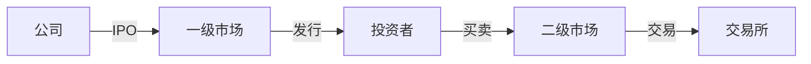

# 入门指引
> 股票投资入门指南
## 内容规划
- 什么是股票
- 股票市场构成
- 开户流程
- 交易规则
---
更新日期：2026-02-20
## 一、什么是股票
### 1.1 股票的定义
**股票**就像一块"公司的拼图"。假设一家公司价值100万，你买了1%的股票，你就拥有了这家公司的1%。
```
🍰 一家公司 = 100万价值
 买1% = 1万股 = 1万价值
 买10% = 10万股 = 10万价值  
 买100% = 100万股 = 100%所有权
```
### 1.2 股票的特点
| 特点 | 通俗解释 |
|------|----------|
| 🎯 **权益性** | 赚钱了能分红，亏钱了就亏损 |
| 🔄 **流动性** | 随时可以买卖变现 |
| ⚠️ **风险性** | 可能赚钱也可能亏光 |
| 💰 **收益性** | 高风险高回报 |
### 1.3 股票 vs 债券
```
📊 对比图：
股票（股东）          债券（债主）
                        
                        
  共同承担风险         固定收取利息
                        
                        
 赚钱→分红           不管赚不赚钱
                        
                        
 亏钱→亏损            到期还本
```
| 对比 | 股票 | 债券 |
|------|------|------|
| 关系 | 股东 | 债主 |
| 收益 | 不固定 | 固定利息 |
| 风险 | 高 | 低 |
| 例子 | 买腾讯股票 | 买国债 |
---
## 二、股票市场构成
### 2.1 市场层级

### 2.2 中国股市板块
### 2.3 参与主体
```
     
       上市公司     ← 发行股票
     
     
       证券公司     ← 交易中介
     
     
        交易所      ← 上交所/深交所/北交所
     
     
        投资者      ← 散户/机构
     
     
       监管机构     ← 证监会
     
```
---
## 三、开户流程
### 3.1 准备材料
```
📋 开户清单：

 ✅ 身份证原件                    
 ✅ 银行卡（最好用常用的）          
 ✅ 手机号码（接收验证码）          
 ✅ 开通证券账户                   

```
### 3.2 开户步骤
```
步骤1️⃣：选择券商
         
步骤2️⃣：下载APP/线下办理
         
步骤3️⃣：填写个人信息
         
步骤4️⃣：风险测评
         
步骤5️⃣：绑定银行卡
         
步骤6️⃣：开户成功！🎉
```
### 3.3 交易时间
```
🕐 A股交易时间表：
09:15  09:25  集合竞价（可以挂单）
      ⭐ 9:15-9:20 可以撤单
      ⭐ 9:20-9:25 不能撤单
09:30  11:30  上午交易时段
      午休时间
13:00  14:57  下午交易时段
14:57  15:00  收盘集合竞价
```
---
## 四、交易规则
### 4.1 交易单位
```
📏 最小交易单位：

  1手 = 100股                    
  最低买入：100股                
  价格最小变动：0.01元           

💡 例子：想买茅台
   当前价格 1800元/股
   最少买 100股 = 18万元
```
### 4.2 涨跌幅限制
```
📈 涨跌幅规则：

  普通股票：±10%                 
  ST股票：±5%                    
  科创板/创业板：±20%            
  新股上市首日：±44%             

💡 例子：昨天收盘10元
   今天最多涨到 11元
   今天最多跌到 9元
```
### 4.3 交易费用
```
💰 交易费用明细：

  佣金（券商）   万分之1-3          
  印花税       卖出时千分之一       
  过户费       万分之0.1           
  规费         万分之0.2           

💡 例子：买10万元股票
   佣金：约10元
   印花税：卖出时100元
   过户费：1元
   共约：111元
```
---
## 五、股票术语
### 5.1 基础术语图解
```
📊 股票买卖流程：
买入              持有              卖出
                                  
                                  
                   
开仓 ▶持仓 ▶平仓 
买入          持有           卖出 
建仓             👤          了结 
                   
```
| 术语 | 意思 |
|------|------|
| 开仓/建仓 | 第一次买入 |
| 平仓/了结 | 全部卖出 |
| 持仓 | 还没卖的股票 |
| 仓位 | 买股票的钱占总钱数的比例 |
| 止损 | 亏到一定程度必须卖 |
| 止盈 | 赚够了就卖 |
### 5.2 K线图解
```
📈 K线（蜡烛图）：
    上涨(红K)           下跌(绿K)
                      
                        
                 
                        
                      
   开盘价              开盘价
                        
   收盘价              收盘价
💡 红色=涨，绿色=跌
```
---
## 六、总结
```
🎯 新手入门要点：
1️⃣  了解基本概念
      股票是什么、市场怎么运作
2️⃣  熟悉交易规则
      时间、费用、涨跌停
3️⃣  掌握基本术语
      开仓、平仓、仓位
4️⃣  先模拟再实战
      用模拟盘练习
📚 下一章：02_基础概念
   了解K线和技术分析
```
---
*本指南由AI自动生成并持续更新*