# 基础概念
> 股票投资基础 concepts
## 内容规划
- K线基础
- 均线系统
- 成交量
- 趋势线
---
更新日期：2026-02-20
## 一、K线基础
### 1.1 什么是K线**就像股票的"心跳图"，线
**K记录每天的价格变动。
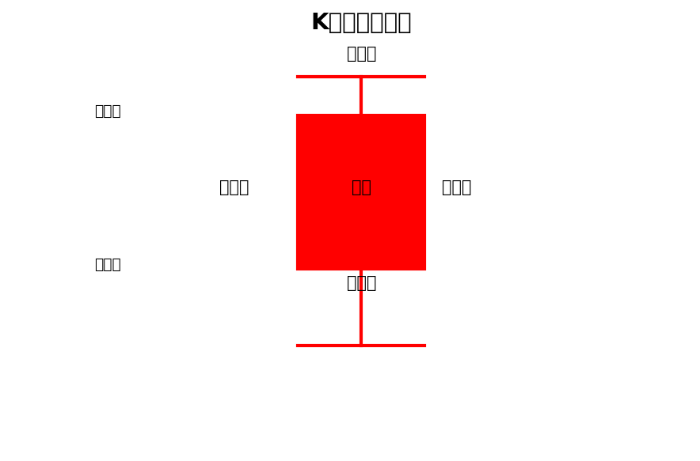
### 1.2 K线颜色

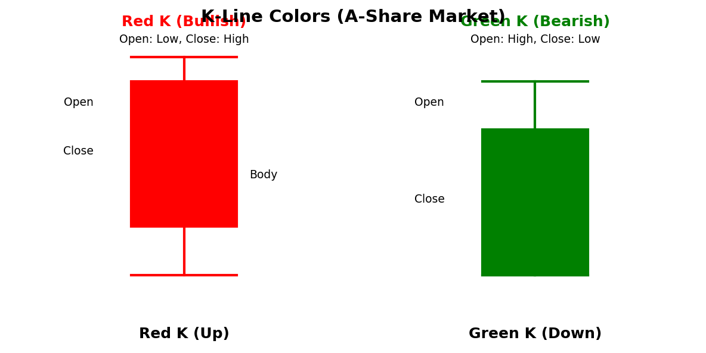

### 1.3 常见K线形态

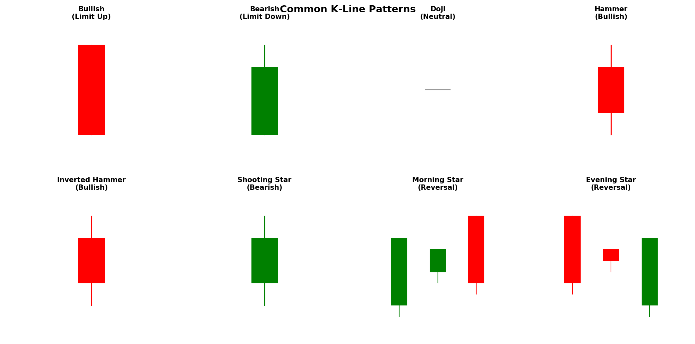

---
## 二、均线系统
### 2.1 什么是均线
**均线**就是平均价格线，把过去N天的收盘价平均一下。
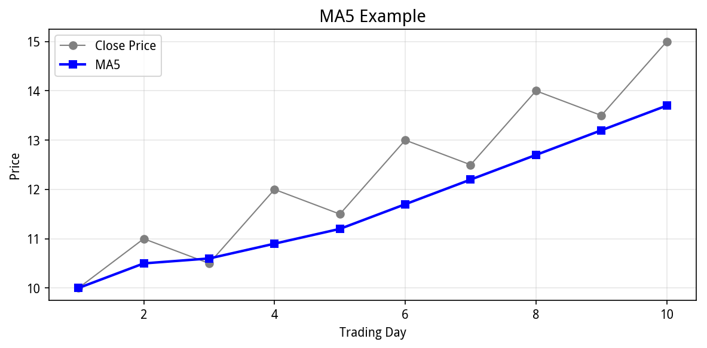
💡 5日均线 = 最近5天的"平均体温"
### 2.2 常见均线

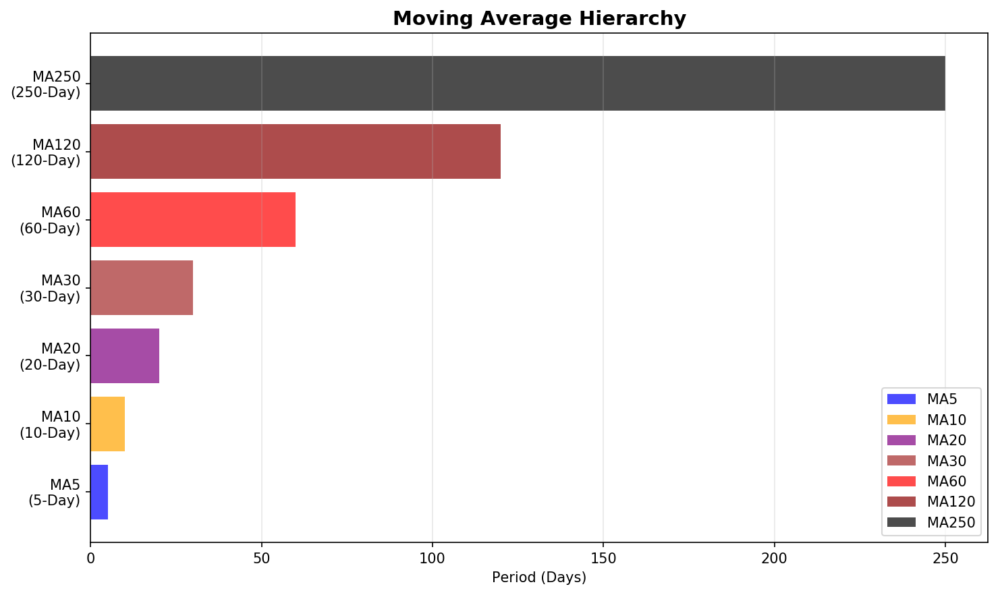

### 2.3 均线金叉/死叉

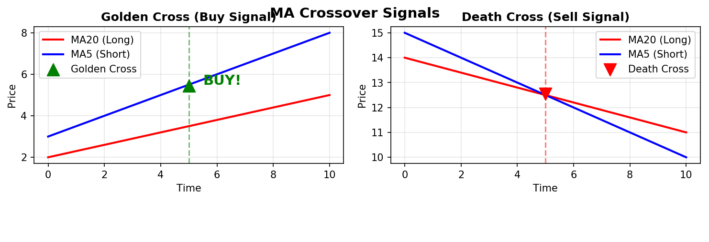

---
## 三、成交量
### 3.1 成交量是什么
**成交量**就是当天买卖了多少股票。

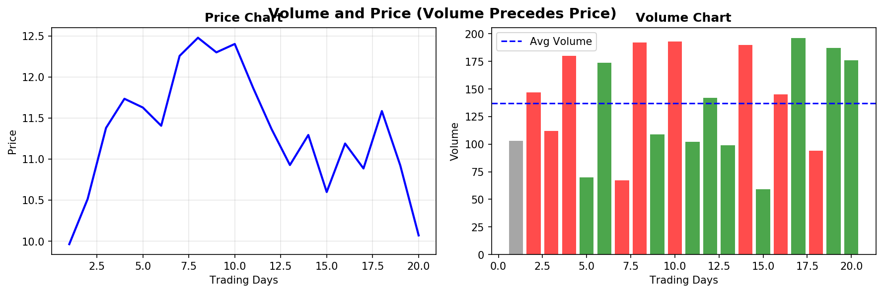

💡 量在价先：成交量放大，价格往往要变
### 3.2 量价关系
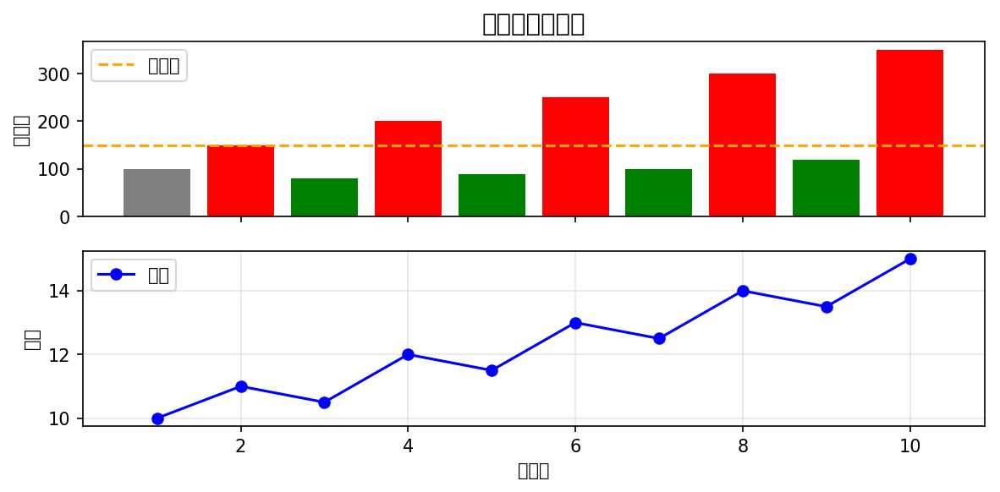
---
## 四、趋势线
### 4.1 趋势分类
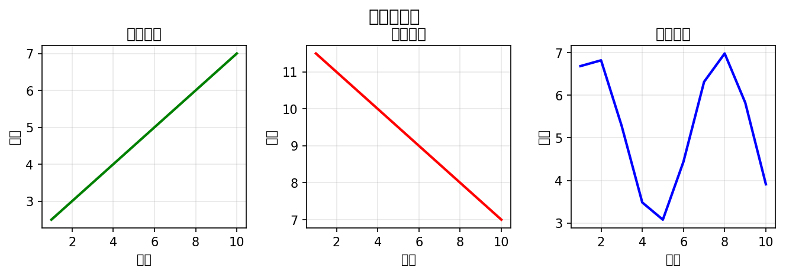
### 4.2 画趋势线


---
## 五、技术指标
### 5.1 MACD

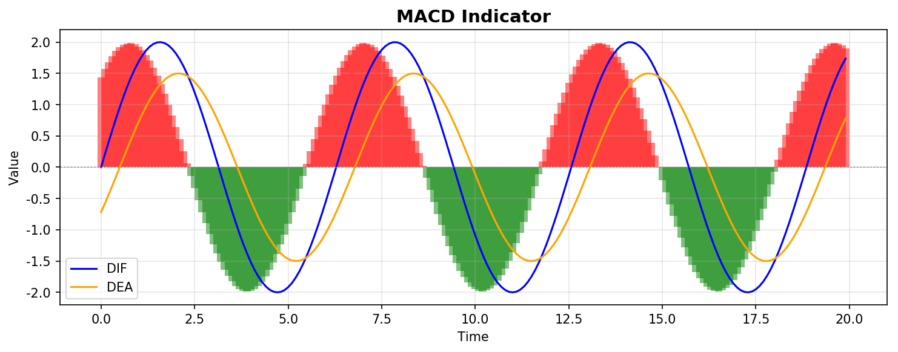
### 5.2 RSI

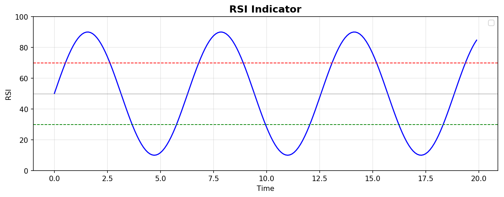
---
## 六、总结
```
🎯 技术分析要点：
1️⃣  会看K线
      知道今天是涨是跌
2️⃣  会看均线
      知道长期短期趋势
3️⃣  会看成交量
      知道有没有主力参与
4️⃣  会画趋势线
      知道支撑位压力位
📚 下一章：03_经济学基础
   了解宏观基本面
```
---
*本指南由AI自动生成并持续更新*