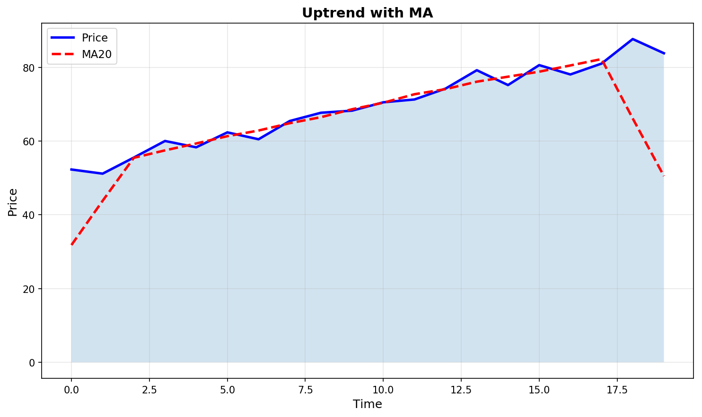
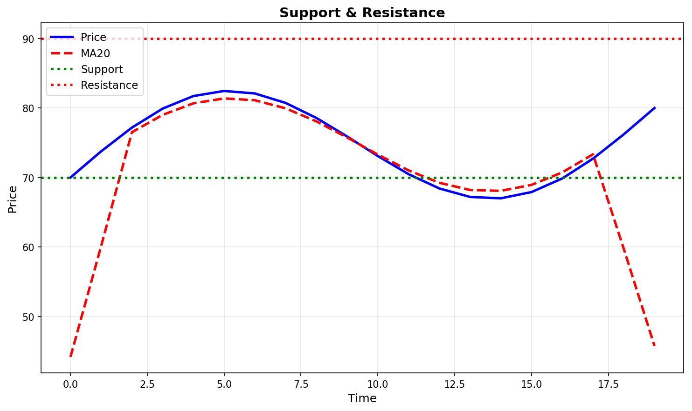
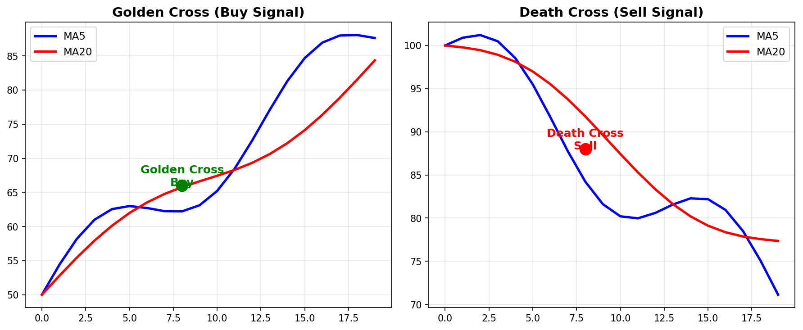

# 均线基础入门

> 移动平均线是最常用的趋势指标，帮助投资者看清价格方向

## 什么是均线

**均线**（Moving Average，MA）是将一定周期内的收盘价进行算术平均，然后连接成线的技术指标。

### 均线的作用



## 常用均线参数

| 均线 | 俗称 | 用途 |
|------|------|------|
| MA5 | 5日均线、周线 | 短线交易 |
| MA10 | 10日均线 | 短期趋势 |
| MA20 | 20日均线、月线 | 中期趋势 |
| MA60 | 60日均线、季线 | 中长线 |
| MA120 | 120日均线、半年线 | 长线趋势 |
| MA250 | 250日均线、年线 | 牛熊分界线 |

## 均线的类型

### 1. 简单移动平均线（SMA）

**计算方法**：将N天的收盘价相加除以N

```
SMA5 = (C1 + C2 + C3 + C4 + C5) / 5
```

优点：简单直观  
缺点：对最新价格反应较慢

### 2. 指数移动平均线（EMA）

**计算方法**：对近期价格赋予更大权重

```
EMAoday = α × Priceoday + (1-α) × EMAyesterday
```

优点：反应灵敏  
缺点：容易产生假信号

### 3. 加权移动平均线（WMA）

**计算方法**：按权重分配，越近期的价格权重越大

> **小贴士**：短线用EMA，长线用SMA

## 均线的基本用法

### 1. 趋势判断

| 均线形态 | 市场含义 |
|----------|----------|
| 多头排列 | 短期 > 中期 > 长期 → 强上涨趋势 |
| 空头排列 | 短期 < 中期 < 长期 → 强下跌趋势 |
| 均线缠绕 | 短期中期长期交织 → 震荡整理 |

### 2. 支撑与阻力



### 3. 金叉与死叉

| 信号 | 形态 | 含义 |
|------|------|------|
| **金叉** | 短期均线从下往上穿过长期均线 | 买入信号 |
| **死叉** | 短期均线从上往下穿过长期均线 | 卖出信号 |



## 均线组合策略

### 葛兰碧均线法则（精华版）

**买入信号：**
1. 均线从下降转为走平，股价上穿均线
2. 股价连续上涨，股价回落至均线附近获得支撑
3. 股价跌破均线，但均线仍在上升，可买入
4. 股价突然暴跌，跌破均线，是买入机会

**卖出信号：**
1. 均线从上升转为走平，股价下穿均线
2. 股价连续下跌，股价反弹至均线附近受阻
3. 股价突破均线，但均线仍在下跌，可卖出
4. 股价突然暴涨，突破均线，是卖出机会

### 常见均线组合

| 组合 | 周期 | 适用场景 |
|------|------|----------|
| 5日+10日 | 短线 | 快速捕捉波段 |
| 20日+60日 | 中线 | 趋势跟踪 |
| 60日+120日 | 中长线 | 确认大趋势 |

## 使用均线的注意事项

### ✅ 正确用法

- 结合趋势使用（顺势而为）
- 多周期分析（日线看方向，60分钟找买点）
- 与成交量配合确认

### ❌ 常见误区

- 均线滞后：股价已经涨了很多，均线才发出信号
- 震荡失效：横盘震荡时均线频繁交叉，产生假信号
- 单一依赖：不能只看均线做决策

## 总结

| 要点 | 记住 |
|------|------|
| 均线的方向就是趋势的方向 | 顺势而为 |
| 多头排列持有，空头排列观望 | 不逆势 |
| 金叉买入，死叉卖出 | 简单有效 |
| 均线是动态的支撑/阻力 | 灵活运用 |

---

**下一步**：学习 [成交量基础](./成交量基础.md) → 了解量价关系
