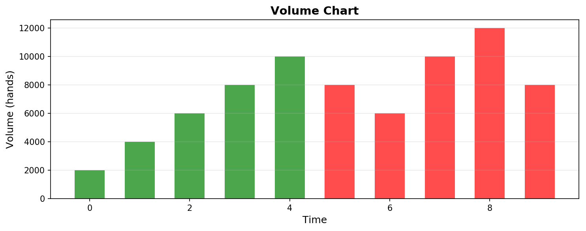
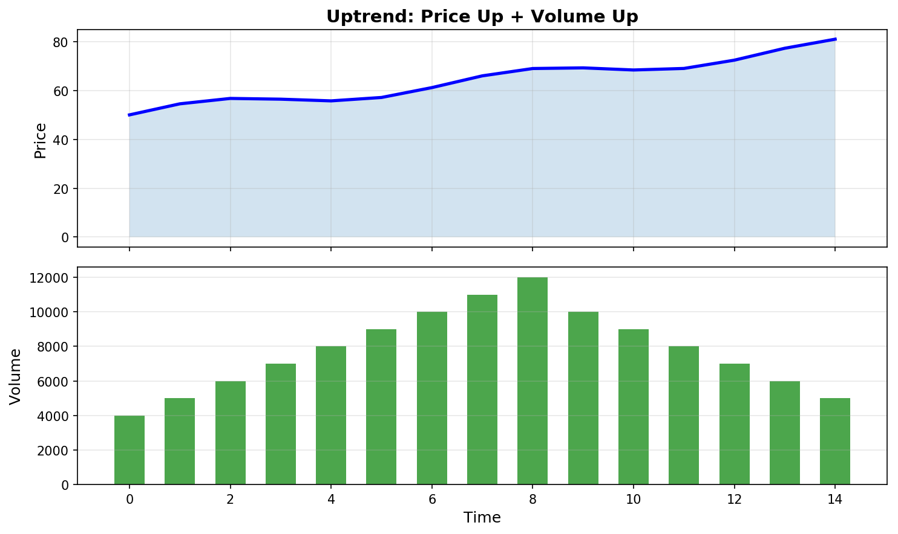
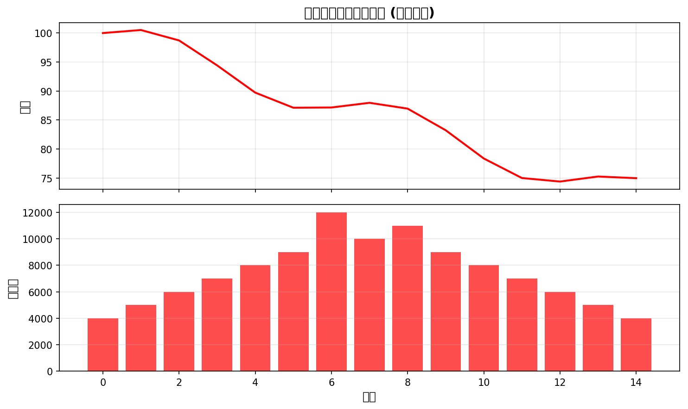

# 成交量基础入门
> 成交量是价格的根源，量在价先，是技术分析的核心要素
## 什么是成交量
**成交量**（Volume）是指在一定时间内股票买卖成交的数量，通常以"手"为单位（1手=100股）。

## 成交量的意义
| 情况 | 成交量 | 含义 |
|------|--------|------|
| 价涨量增 | 放大 | 资金积极入场，趋势可能延续 |
| 价涨量缩 | 缩小 | 上涨动能不足，可能回调 |
| 价跌量增 | 放大 | 恐慌抛售，可能见底 |
| 价跌量缩 | 缩小 | 卖压减轻，可能见底 |
## 量价关系八大口诀
```
1. 价涨量增 → 继续上涨（健康信号）
2. 价涨量缩 → 顶背离预警（小心回调）
3. 价跌量增 → 继续下跌（恐慌信号）
4. 价跌量缩 → 底背离信号（可能见底）
5. 低位放量 → 主力建仓
6. 高位缩量 → 主力出货
7. 放量突破 → 有效突破
8. 缩量回调 → 机会低吸
```
## 成交量的分析方法
### 1. 放量与缩量
| 术语 | 定义 | 含义 |
|------|------|------|
| **放量** | 成交量较前一日明显放大 | 方向明确，多空分歧大 |
| **缩量** | 成交量较前一日明显缩小 | 方向不明，观望情绪浓 |
| **地量** | 成交量创阶段性新低 | 可能变盘在即 |
| **天量** | 成交量创阶段性新高 | 可能见顶信号 |
### 2. 量价配合
```
上涨趋势中的量价关系：

    → 健康上涨：价涨量增
```
```
下跌趋势中的量价关系：

    → 恐慌下跌：价跌量增
```
### 3. 量价背离
| 类型 | 形态 | 含义 |
|------|------|------|
| **顶背离** | 股价创新高，成交量不创新高 | 上涨乏力，可能见顶 |
| **底背离** | 股价创新低，成交量不创新低 | 下跌无力，可能见底 |
## 成交量的实战应用
### 1. 突破买入
```
    价格
            突破前高
  100    
   90  
   80 
      → 时间
            ↑
         成交量放大
    放量突破前高，是有效突破信号
```
### 2. 回调缩量
```
    价格
             ↓ 回调
  100         
   90           ← 缩量回调
   80  
      → 时间
            ↓
         成交量萎缩
    缩量回调到均线，是低吸机会
```
### 3. 放量滞涨
```
    价格
      
   90     放量
   80     █████
      
      → 时间
            ↑↑↑
         成交量放大，价格不涨
    放量不涨，警惕回调风险
```
## 换手率
**换手率** = 当日成交股数 / 流通股本 × 100%
| 换手率 | 市场含义 |
|--------|----------|
| < 3% | 成交清淡，观望 |
| 3-7% | 成交活跃 |
| 7-15% | 高度活跃 |
| > 15% | 异常活跃，可能妖股 |
> **注意**：新股上市首日换手率通常很高，别误以为是活跃信号
## 使用成交量的注意事项
### ✅ 正确用法
- 结合股价位置判断（低位放量可信，高位放量警惕）
- 连续放量比单日放量可靠
- 配合均线和趋势使用
### ❌ 常见误区
- ❌ 迷信地量见地价（震荡市中地量后还有地量）
- ❌ 放量就能涨（高位放量可能是主力出货）
- ❌ 忽视大盘成交量（系统风险时个股量能失真）
## 总结
| 要点 | 记住 |
|------|------|
| 量在价先 | 成交量反映资金动向 |
| 价涨量增，价跌量缩 | 健康量价关系 |
| 放量突破，缩量回调 | 最佳买卖点 |
| 高位放量要警惕 | 可能是主力出货 |
---
**下一步**：学习 [股票术语](./股票术语.md) → 了解常见投资术语