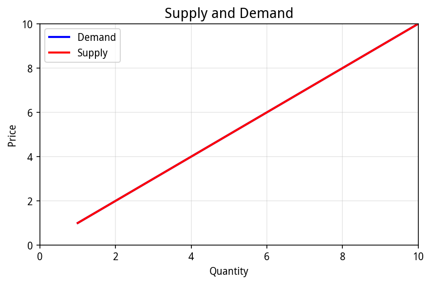
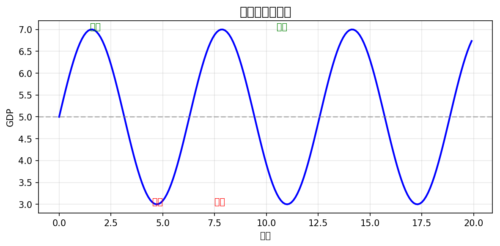

# 经济学基础

> 理解经济运行的基本规律，是股票投资的必修课

## 内容规划

- 供需关系
- 边际效应
- 机会成本
- 通货膨胀
- 货币政策
- 财政政策

---

更新日期：2026-02-25

## 一、供需关系

### 1.1 什么是供需

```
📊 供需关系：

供给（卖方）              需求（买方）
    │                        │
    ▼                        ▼
  商品                      钱
    │                        │
    └────────┬───────────────┘
             │
             ▼
        ┌────────┐
        │  市场  │
        │  价格  │
        └────────┘

💡 供不应求 → 涨价
💡 供过于求 → 跌价
```

### 1.2 供需曲线



---

## 二、边际效应

### 2.1 什么是边际

"边际"就是"多增加一点"的意思。

```
📊 边际概念：

比如吃包子：
  第1个包子 → 很香，满足感100%
  第2个包子 → 还可以，满足感60%
  第3个包子 → 饱了，满足感20%
  第4个包子 → 吃不下，满足感0%甚至负数

💡 这就是"边际效用递减"
```

### 2.2 边际思维与投资

```
💰 股票投资中的边际思维：

❌ 错误想法：
  "这只股票我已经亏了50%，必须加仓摊低成本"

✓ 正确想法：
  "如果我现在再买1万块，这1万块能带来多少预期收益？
   相比于其他机会，哪个边际收益更高？"

📊 边际决策原则：
  比较的是"多投这笔钱的预期收益"vs"其他机会"
  而不是"之前亏了多少"
```

### 2.3 边际成本

```
📈 边际成本在商业中的应用：

制造业：
  生产100个杯子 → 总成本1000元，每个10元
  生产101个杯子 → 总成本1005元，每个9.95元
  → 边际成本5元

互联网：
  开发软件 → 固定成本高
  每多卖一份 → 边际成本接近0
  → 为什么互联网公司容易爆发式增长

💡 投资启示：
  寻找边际成本不断下降的商业模式
```

---

## 三、机会成本

### 3.1 什么是机会成本

做一件事放弃的其他机会，就是这件事的机会成本。

```
💵 机会成本例子：

你 有10万元，可以：
  A. 买股票（可能赚20% = 2万）
  B. 买理财（赚4% = 4千）
  C. 存定期（赚2% = 2千）

如果你选择A：
  机会成本 = 4千（放弃理财的收益）
  
如果你选择B：
  机会成本 = 2千（放弃定期的收益）
  
如果你选择C：
  机会成本 = 4千（放弃理财的收益）

⚠️ 注意：亏掉的2万不是机会成本！
   机会成本是你放弃的潜在收益
```

### 3.2 机会成本在投资中的应用

```
📊 投资中的机会成本思维：

❌ 错误决策：
  "这只股票套牢了，不卖就不是亏"

✓ 正确决策：
  "如果我现在割肉，10万可以买另一只更有潜力的股票
   预期能赚15%，这就是机会成本"

🔑 核心思维：
  资金总是有机会成本的
  持有"差的资产"意味着放弃"好的资产"

💡 定期检视自己的持仓：
  如果这只股票现在不是你的首选，你会买入吗？
  不会的话，说明机会成本太高，该换股了
```

### 3.3 沉没成本 vs 机会成本

```
📊 两种成本的区别：

┌─────────────────────────────────────────┐
│  沉没成本（已发生，不可追回）            │
│  例：去年买股票亏了5万                   │
│  → 不影响当前决策，该不该卖只看未来      │
├─────────────────────────────────────────┤
│  机会成本（未发生，放弃的收益）          │
│  例：这10万买股票就不能买理财            │
│  → 影响当前决策，选择最优方案            │
└─────────────────────────────────────────┘

💡 投资金句：
  "不要让沉没成本影响机会成本的决策"
```

---

## 四、通货膨胀

### 4.1 什么是通胀

**通胀**就是钱变"毛"了，同样钱买的东西变少了。

```
💰 通胀例子：

2020年：10元 = 1碗面
2025年：15元 = 1碗面

钱还是那些钱，但购买力下降了！
```

### 4.2 通胀类型

```
📊 通胀分类：

┌─────────────────────────────────┐
│  温和通胀（2-3%）              │
│  └── 经济健康增长，利于股市     │
├─────────────────────────────────┤
│  恶性通胀（>50%）              │
│  └── 经济崩溃，持有黄金/房产   │
├─────────────────────────────────┤
│  通货紧缩（-）                 │
│  └── 钱更值钱，但经济萧条     │
└─────────────────────────────────┘
```

---

## 五、货币政策

### 5.1 央行工具

```
🏦 央行调节经济的工具：

         ┌─────────────────┐
         │     央行        │
         └────────┬────────┘
                  │
    ┌─────────────┼─────────────┐
    │             │             │
    ▼             ▼             ▼
┌───────┐   ┌───────┐    ┌───────┐
│降准   │   │降息   │    │逆回购 │
│释放资金│   │降低利率│    │投放货币│
└───────┘   └───────┘    └───────┘

  ↑ 放水刺激经济          ↓ 收紧防止通胀
```

### 5.2 降准 vs 降息

```
📊 降准vs降息：

降准（降低存款准备金率）
   │
   ▼
 银行可以放贷的钱变多
   │
   ▼
 市面资金变多 → 股市可能上涨

降息（降低利率）
   │
   ▼
 存钱利息变少 → 钱流向股市
   │
   ▼
 贷款成本变低 → 企业扩张
```

---

## 六、财政政策

### 6.1 政府花钱

```
💵 财政政策：

         政府
          │
    ┌─────┴─────┐
    │           │
    ▼           ▼
  花钱         收钱
  │           │
  ▼           ▼
┌─────┐   ┌─────┐
│基建 │   │税收 │
│补贴 │   │国债 │
│投资 │   │收费 │
└─────┘   └─────┘

💡 花钱刺激 = 扩张性财政政策
💡 收钱控制 = 紧缩性财政政策
```

---

## 七、经济周期

### 7.1 经济周期图



💡 复苏期：适合买股票
💡 繁荣期：股票大涨
💡 衰退期：开始减仓
💡 萧条期：现金为王
```

---

## 八、总结

```
🎯 经济学核心要点：

1️⃣  供需决定价格
     └── 供不应求涨，供过于求跌

2️⃣  边际思维做决策
     └── 关注边际收益，不要被沉没成本影响

3️⃣  机会成本很重要
     └── 资金永远有机会成本，定期检视持仓

4️⃣  通胀影响购买力
     └── 温和通胀有利于股市

5️⃣  货币政策是关键
     └── 降准降息利好股市

6️⃣  财政政策看政府
     └── 基建投资利好相关股票

7️⃣  跟着周期走
     └── 复苏买、繁荣持、衰退跑

📚 下一章：04_宏观经济学
   了解GDP、CPI等宏观指标
```

---

*本指南由AI自动生成并持续更新*
