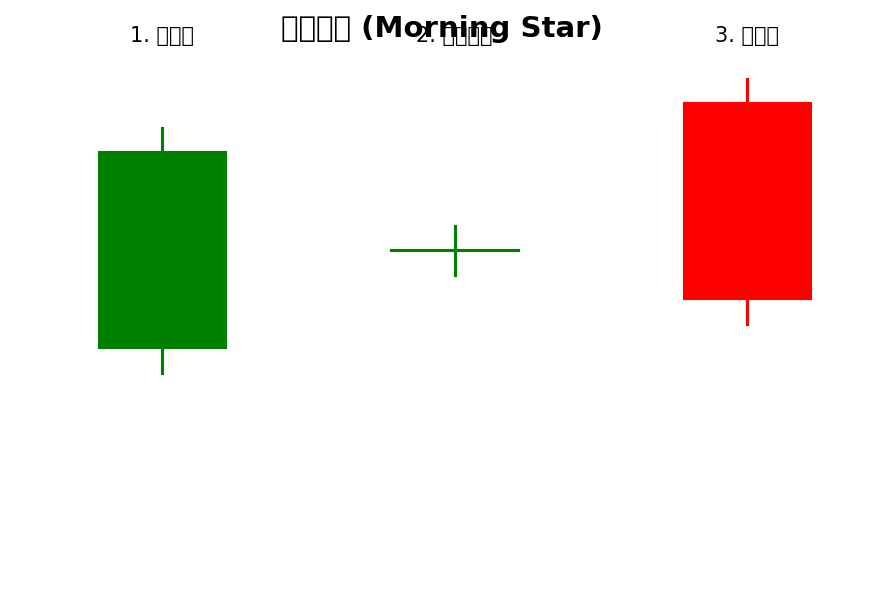
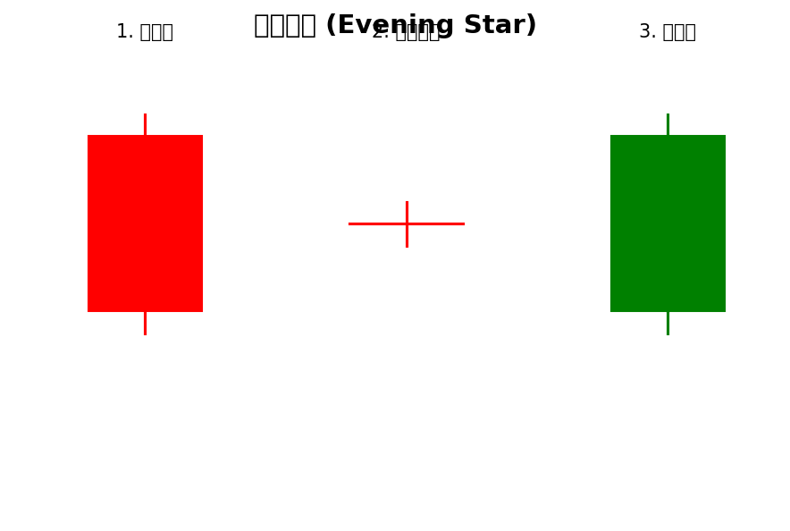
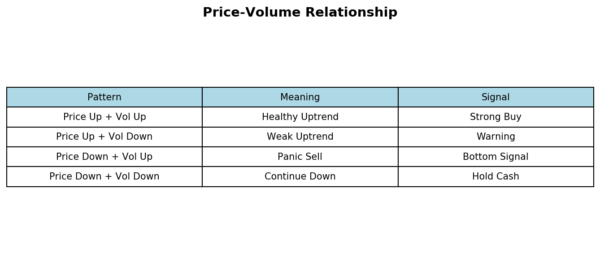

# 技术分析
> 通过图表和指标预测股价走势
## 内容规划
- K线形态
- 均线战法
- 成交量分析
- MACD指标
- 形态分析
---
更新日期：2026-02-20
## 一、K线形态
### 1.1 单一K线信号

### 1.2 经典组合形态


---
## 二、均线战法
### 2.1 均线多头排列
```
📈 多头排列（上涨趋势）：
短期均线
       5日
       10日
       20日
       60日
       120日
   ▶ 时间
💡 均线向上发散，每次回调都是买入机会
```
### 2.2 均线空头排列
```
📉 空头排列（下跌趋势）：
       120日
       60日
       20日
       10日
       5日
   ▶ 时间
短期均线
💡 均线向下发散，每次反弹都是卖出机会
```
### 2.3 均线买卖点
**买入信号**：
- ✅ 均线金叉（5日上穿10日）
- ✅ 股价站上20日均线
- ✅ 回调不破均线支撑
- ✅ 均线多头排列形成
**卖出信号**：
- ❌ 均线死叉（5日下穿10日）
- ❌ 股价跌破20日均线
- ❌ 均线空头排列形成
- ❌ 放量跌破均线
---
## 三、成交量分析
### 3.1 量价关系

      ■■
       成交量 →
      涨但没人跟进，可能回落
```
### 3.2 地量地价
```
📉 地量地价（底部信号）：
       价格           成交量
                      
    底部   ■       
          ■■■            地量
           
                  ↑地量后可能见底
```
---
## 四、MACD指标
### 4.1 MACD组成
```
📊 MACD结构：
       DIF线（快线）
    
             ████████
         ██ 零轴
              ████████
          DEA线（慢线）
红柱（多头）      绿柱（空头）
```
### 4.2 MACD交易信号
```
🎯 MACD买卖点：
【金叉买入】
    DIF
 █ 零轴
          ████
      █
              ↑
             DEA
    DIF上穿DEA = 买入信号
【死叉卖出】
    DIF
 █ 零轴
      ████
         █
             ↑
            DEA
    DIF下穿DEA = 卖出信号
【底背离】买入
   价格创新低    ←
                   DIF没创新低
   MACD没创新低 ←  = 底背离 = 买入
【顶背离】卖出
   价格创新高    ←
                   DIF没创新高
   MACD没创新高 ←  = 顶背离 = 卖出
```
---
## 五、形态分析
### 5.1 整理形态
```
📊 箱体整理：
    
       压力位   →
    
               
               
               
    
       支撑位   →
    
💡 震荡行情：高抛低吸
💡 突破箱体：顺势而为
```
### 5.2 突破形态
```
📈 突破形态：
【突破压力位】
    价格
      ▲
 突破     
        
       
      
 ▶ 时间
      ↑突破点 = 买入
【跌破支撑位】
    价格
      ▲
      
       
        
         
 ▶ 时间
      ↑跌破点 = 卖出
```
### 5.3 反转形态
```
📕 头肩顶（顶部反转）：
        
                左肩
           
           
              
            
                头
        
                
              右肩
           
       
           ↑颈线跌破=卖出
📗 头肩底（底部反转）：
        
                左肩
           
           
              
            
                头
        
                
              右肩
           
       
           ↑颈线突破=买入
```
---
## 六、总结
```
🎯 技术分析要点：
1️⃣  K线是基础
      学会识别单K和组合形态
2️⃣  均线看趋势
      多头排列持股，空头排列持币
3️⃣  成交量辨真假
      放量突破真突破，地量地价要抄底
4️⃣  MACD抓拐点
      金叉买入，死叉卖出，背离预判顶底
5️⃣  形态定买卖
      突破跟进，反转逃顶
⚠️  注意事项：
   - 不要单一指标决策
   - 多指标共振更可靠
   - 设好止损位
   - 顺势而为
📚 下一章：05_会计学基础
   学会看财报
```
---
*本指南由AI自动生成并持续更新*